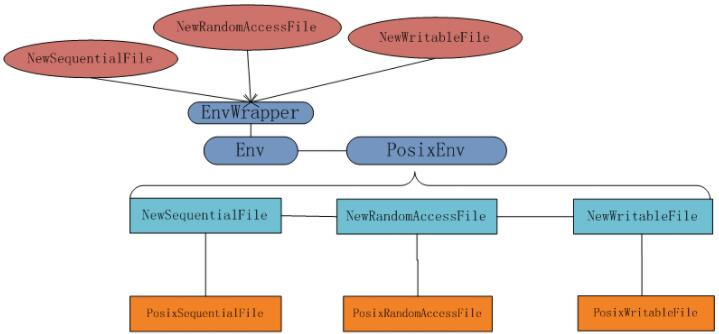

```
include
└── leveldb
    ├── c.h              => c binding
    ├── cache.h          => cache接口
    ├── comparator.h     => 比较器接口
    ├── db.h             => DB接口
    ├── dumpfile.h       => 产生dump文件
    ├── env.h            => 为跨平台准备的env接口
    ├── export.h         => 定义LEVELDB_EXPORT宏
    ├── filter_policy.h  => fliter策略，用于缓存，请看到文档及相应实现
    ├── iterator.h       => 迭代器，用于遍历数据库中存储的数据
    ├── options.h        => 包含控制数据库的Options，控制读的WriteOptions，ReadOptions
    ├── slice.h          => Slice的接口
    ├── status.h         => leveldb中大多接口返回的Status接口
    ├── table.h           => immutable接口
    ├── table_builder.h  => 用于创建table的构建器接口
    └── write_batch.h    => 使多个写操作成为原子写的接口
```
# c.h
leveldb十分体贴的为仅使用c的代码提供了c binding.几乎所有c++的接口都有对应的c函数，例如打开一个数据库，本来的操作为:
```c++
leveldb::DB* db;
leveldb::Options options;
options.create_if_missing = true;
leveldb::Status status = leveldb::DB::Open(options，"/tmp/testdb"， &db);
```
在c中
```c
#include <leveldb/c.h>
#include <stdio.h>
#include <stdlib.h>
 
int main()
{
    leveldb_t *db;
    leveldb_options_t *options = leveldb_options_create();
    leveldb_options_set_create_if_missing(options， 1);
 
    char *errptr = NULL;
 
    db = leveldb_open(options， "testdb"， &errptr);
 
    if (errptr != NULL)
    {
        printf("open error: %s\n"， errptr);
    }
 
    return 0;
}
```
可以看到c的版本要繁琐的多，不过也能完成相应的工作.

这里需要注意的是，leveldb的c binding并没有提供用到的结构体实现，而是各个结构体的指针. 并且，原来c++代码中为对象的属性赋值的操作都实现为了函数.
google解释是因为这方便修改内部实现，而不必重编译客户端代码.c binding中没有Slice对应的结构体，对应的，用户需要传入一个指针及长度.

对于错误处理，c++版本中用了Status类，而c binding中则使用了errptr指针.

在函数调用中，调用者传入一个类型为char** errptr变量. *errptr要么是NULL，要么是malloc分配的一段内存.在函数调用后，如果成功，则errptr不会被改变.否则，errptr所指向内存将会被free，并赋予一块新malloc出来的内存.

由于C89没有bool，所以以unsigned char代替.0代表false，剩余的都为true.

在文档中，还说明了，c binding没有实现的功能:

- options没有getter，不能获得options中属性的值.
- comparator不能对key进行修改
- 不能自定义迭代器，db，env和cache

整体上来说，c binding已经能实现大部分的功能.

# cache.h

为了提高性能，cache是不可避免的.cache.h中提供了Cache接口.LevelDB提供了基于LRU(least recent used)策略的Cache.如果需要提供自定义的cache方法，可以继承Cache类，并实现其中的纯虚函数.

可以看到Handle就是一个空结构体，没有成员变量，也没有成员函数.那这是做什么的呢?

再仔细看Cache的接口，可以看到Handle的作用–作为key与value之间桥梁.调用者查询Cache时，Lookup返回Handle*，用户根据Handle调用Value获取值，使用完毕后调用Release销毁该 Handle.由于用户可以自定义Cache，所以Handle仅仅是一个虚的结构体.在具体实现时，可以参考 leveldb.先自己定义一个结构体，在实现Cache相应的函数时，在返回或使用时调用 reinterpret_cast<Cache::Handle*>.

TODO: 这段什么意思？

第二个有趣的地方是private部分.Cache的接口提供了三个函数LRU_Remove，LRU_Append，Unref.同时还有一个不完全的结构体声明struct Rep，以及相应的指针Rep* rep_.这部分代码看的莫名其妙.由于Cache只是一个纯虚类，其构造函数和析构函数都是空的函数，而且由于其都为私有成员，子类也不可能调用.于是没有任何代码可以执行这三个函数，也不能使用rep_.那这块代码是做什么的呢?

通过阅读util/cache.cc，我们也可以看到其实现中也确实没有实现这几个函数.不过更有趣的事情发生了，查看LRUCache，这里边竟然出现了三个函数，并且有相应的实现!这…

个人的猜测: 由于cache很可能刚开始就是只有LRUCache，并没有独立出来成为接口.因此最初的实现中，就把三个函数放在了私有成员中.而经过一阵子的开发，提炼出来成为了接口，只不过三个函数一直没有删除，就留在了接口中.而Rep也可能是类似的原因.由于现在只是初看代码，这个问题留在之后探讨.

# comparator.h

Comparator提供了Comparator接口，用于比较key的大小，作为存放位置的参考.其接口定义也较为简单.
```c++
class Comparator {
 public:
  virtual ~Comparator();
 
  //返回<0，=0，>0
  virtual int Compare(const Slice& a， const Slice& b) const = 0;
  virtual const char* Name() const = 0;
  // TODO：学习此处实现的时候再去看这俩虚函数是干啥的
  virtual void FindShortestSeparator(
      std::string* start，
      const Slice& limit) const = 0;
  virtual void FindShortSuccessor(std::string* key) const = 0;
}
```

# db.h

db.h是使用leveldb时最经常include的头文件.在这个头文件中提供了DB的接口的定义，也是我们需要的部分.在db.h中，定义了Snapshot，Range，DB三个接口.
- Range为一个Slice对，定义了[start，end).符合C++的习惯.
- Snapshot为DB的某个特定状态.由于其只读，因此多线程访问并不需要锁.
- DB则提供了经常使用的几个方法: 
```c++
class DB {
 public:
  static Status Open(const Options& options，
                     const std::string& name，
                     DB** dbptr);
 
  DB() { }
  virtual ~DB();
  virtual Status Put(const WriteOptions& options，
                     const Slice& key，
                     const Slice& value) = 0;
  virtual Status Delete(const WriteOptions& options， const Slice& key) = 0;
  virtual Status Write(const WriteOptions& options， WriteBatch* updates) = 0;
  virtual Status Get(const ReadOptions& options，
                     const Slice& key， std::string* value) = 0;
  virtual Iterator* NewIterator(const ReadOptions& options) = 0;      virtual const Snapshot* GetSnapshot() = 0;
  virtual void ReleaseSnapshot(const Snapshot* snapshot) = 0;
  virtual bool GetProperty(const Slice& property， std::string* value) = 0;
  virtual void GetApproximateSizes(const Range* range， int n，
                                   uint64_t* sizes) = 0;
  virtual void CompactRange(const Slice* begin， const Slice* end) = 0;  
 private:
  // No copying allowed
  DB(const DB&);
  void operator=(const DB&);
};
```

DB在内部实现中加上了合适的锁，因此在并发的情况下，多个线程访问该变量，并进行操作是安全的.

DB中的Open为static方法.在实现时，其生成了DB的实现，并返回给用户.

剩余的方法中，GetProperty方法用于提供DB的运行状态，其中包括leveldb.num-files-at-level<N>，leveldb.stats，leveldb.sstables.传入的变量类型也为Slice.

Slice在后面会说到，其是google为了减少复制所实现的一个类型，并在LevelDB大量使用.Slice的优势在于其复制的代价十分低廉.虽然string的复制代价也很低(string采用了写时拷贝的策略)，但是Slice更低.当然，坑也更多.

CompactRange用于压缩某个范围内的数据.这个函数几乎不会被调用，除非真的需要，同时也真的明白leveldb的原理的情况下.

DB通过delete禁止了复制构造函数和拷贝函数.这也是合理的.如果有多个DB实例，那对于文件的写将会出现混乱.

# dumpfile.h

产生dump文件

# env.h

将底层系统调用和文件系统进行封装：

- 在env.h中，leveldb抽象了一层接口Env，将系统调用，文件操作，文件锁，线程库等系统调用进行了封装，成为了Env.
- 另外将文件抽象成了RandomAccessFile，SequentialFile，WritableFile.

这么抽象的好处显而易见: 跨平台更为简单.客户端调用接口抽象出来的一致方法.使得不同平台下的代码更为一致.而实现跨平台也很简单.无论是windows，还是Unix，甚至是android及ios，各个平台只需要实现相应的方法就能完成porting(移植)的工作.这种方式在开发跨平台代码时很值得借鉴.

由于leveldb对于文件接口使用的较多，所以env中有很多文件操作的接口.除此之外还有线程，logger，时间等使用到的接口.查看代码可以看出，其是庞大的系统调用中的一个非常的微小集合.

```c++
class Env {
 public:
  Env() { }
  virtual ~Env();
  static Env* Default();
  virtual Status NewSequentialFile(const std::string& fname，
                                   SequentialFile** result) = 0;
  virtual Status NewRandomAccessFile(const std::string& fname，
                                     RandomAccessFile** result) = 0;
  virtual Status NewWritableFile(const std::string& fname，
                                 WritableFile** result) = 0;
  virtual bool FileExists(const std::string& fname) = 0;
  virtual Status GetChildren(const std::string& dir，
                             std::vector<std::string>* result) = 0;
  virtual Status DeleteFile(const std::string& fname) = 0;
  virtual Status CreateDir(const std::string& dirname) = 0;
  virtual Status DeleteDir(const std::string& dirname) = 0;
  virtual Status GetFileSize(const std::string& fname， uint64_t* file_size) = 0;
  virtual Status RenameFile(const std::string& src，
                            const std::string& target) = 0;
  virtual Status LockFile(const std::string& fname， FileLock** lock) = 0;
  virtual Status UnlockFile(FileLock* lock) = 0;
  virtual void Schedule(
      void (*function)(void* arg)，
      void* arg) = 0;
  virtual void StartThread(void (*function)(void* arg)， void* arg) = 0;
  virtual Status GetTestDirectory(std::string* path) = 0;
  virtual Status NewLogger(const std::string& fname， Logger** result) = 0;
  virtual uint64_t NowMicros() = 0;
  virtual void SleepForMicroseconds(int micros) = 0;
 
 private:
  // No copying allowed
  Env(const Env&);
  void operator=(const Env&);
};
```
Schedule与StartThread不同在于，StartThread会创建一个新的线程，而Schedule则在后台线程运行function.

有时候，我们需要覆盖leveldb提供的Env部分方法（例如StartThread）同时保持其他的方法为默认的实现。Env是一个抽象类，我们是不能定义Env 类型的对象的。不过，所以提供了一个EnvWrapper，可以生成该类型的对象，并且只需要重写部分方法，不用把Env中的所有方法都重写一遍：:

```c++
class EnvWrapper : public Env {
 public:
  // Initialize an EnvWrapper that delegates all calls to *t
  explicit EnvWrapper(Env* t) : target_(t) { }
  virtual ~EnvWrapper();
 
  // Return the target to which this Env forwards all calls
  Env* target() const { return target_; }
 
  // The following text is boilerplate that forwards all methods to target()
  Status NewSequentialFile(const std::string& f， SequentialFile** r) {
    return target_->NewSequentialFile(f， r);
  }
  Status NewRandomAccessFile(const std::string& f， RandomAccessFile** r) {
    return target_->NewRandomAccessFile(f， r);
  }
  ...
 private:
  Env* target_;
};
```
其实EnvWrapper的实现很简单，就是提供env的指针target_，并在调用方法时调用target的方法。使用的时候继承EnvWrapper，并覆盖相应的函数即可，例如传给EnvWrapper 的构造函数的类型是PosixEnv，所以，最后调用的都是PosixEnv类的成员变量。这就是设计模式中的代理模式，EnvWrapper只是进行了简单的封装，它的代理了Env的子类PosixEnv。
EnvWrapper和Env与PosixEnv的关系如下：


# export.h

定义LEVELDB_EXPORT宏，用于导出公共Symbol

# filter_policy.h

包含了FilterPolicy接口.由于leveldb的数据存储在文件中，因此一次Get请求可能会引起多次的读操作.Filter的作用就在于通过空间换时间.当leveldb读取某个key时，首先访问filter，以判断数据是否在sstable中.filter的数据存储在内存中，访问速度很高，同时也减少文件IO，提高效率.leveldb提供了一个内置实现: BloomFilterPolicy.其基于Bloom Filter，有兴趣可以读一下.根据Google提供的数据，一个10bit的Bloom Filter可以降低Get访问磁盘的次数到1/100.
```c++
class FilterPolicy {
 public:
  virtual ~FilterPolicy();
  virtual const char* Name() const = 0;
  virtual void CreateFilter(const Slice* keys， int n， std::string* dst)
      const = 0;
  virtual bool KeyMayMatch(const Slice& key， const Slice& filter) const = 0;
};
```

# iterator.h

在该头文件中，声明了Iterator接口，该接口主要用于遍历数据库中的数据。leveldb中有多个Iterator的实现，用于遍历Table及Db中的数据。
Iterator中的const方法是线程安全的(因为访问该方法不改变数据)，剩余的方法在并发条件下需要加锁。

不同于其他接口，Iterator提供了注册Cleanup函数的方法.当Iterator被释放时，会按注册的顺序调用CleanupFunction，释放资源.

# options.h

options.h中给出了经常用到的三个Option: Options， ReadOptions， WriteOptions。这三种Options是三种struct。

# slice.h

在leveldb中，为了减少数据复制的负担，对于需要传递字符串的部分，都采用了Slice类。string虽然性能也很好，但是其实现有多种，在传递数据时仍然会发生数据拷贝。

Slice其实就是一个数组的变形，其private的成员包含了一个指向数据的指针以及该数据的长度.而在构造函数中，其仅仅复制指针，而不是内存.拷贝则直接使用了默认的实现.因此，无论是构造还是拷贝，其操作都非常少.因此效率极高. 当然，这么做也有坏处.Slice所对应的data_是由传入参数所保持的.一旦传入参数所对应的指针失效了，则Slice的data_就变成了野指针，Slice也跟着失效，从而导致问题的发生.例如下段代码:
```c++
leveldb::Slice slice;
if (...) {
  std::string str = ...;
  slice = str;
}
Use(slice);
```
slice引用了str中的指针.由于str的scope在{}内,因此,当{}运行结束后,str就失效了,进而,其指针也失效.而之后对slice的使用就变得非常危险。

# status.h

status.h中包含了Status的声明.Status是leveldb大多数函数调用的返回值.其作用类似于errno,只不过封装的更为完善,也更为c++.

Status的数据存储在state_中.state_是一个长度至少为6的字符串.前四位为message的length,第5位为status的状态,再之后的为message。

# table.h

talbe是一张按照key进行排序的map.其状态为只读.当用户的写超过一定数量时,leveldb将会生成一个table表.而后由后台线程进行处理,生成sstable.放入磁盘中.具体内容在之后分析leveldb表的格式及源码时再进行了解.

# tablebuilder.h

TableBuilder用于创建Table.

# write_batch.h

WriteBatch为leveldb提供了原子修改的功能.调用者可以在一个batch中多次调用Put和Delete.而后通过db->Write将修改一次性写入到数据库中,而不必担心写到一半出现异常,从而导致数据库数据不一致的状态.作为功能类,WriteBatch的接口十分简洁.仅仅提供了Put,Delete和Clear功能.同时提供了一个Handler,用于遍历Batch中的数据.

WriteBatch只有一个成员变量: string rep_.该变量是实现原子修改的关键.实际上,对于WriteBatch的Put,Delete,实际上都是对rep_的操作.在调用DB::Write时,DB将rep_的数据一次性写入log中,而后将数据迭代存入到内存中.由于是一次性写入log,因此能保证写入一致性.

```c++
class WriteBatch {
 public:
  WriteBatch();
  ~WriteBatch();
 
  void Put(const Slice& key, const Slice& value);
  void Delete(const Slice& key);
  void Clear();
 
  // Support for iterating over the contents of a batch.
  class Handler {
   public:
    virtual ~Handler();
    virtual void Put(const Slice& key, const Slice& value) = 0;
    virtual void Delete(const Slice& key) = 0;
  };
  Status Iterate(Handler* handler) const;
 
 private:
  friend class WriteBatchInternal;
  std::string rep_;  // See comment in write_batch.cc for the format of rep_
  // Intentionally copyable
};
```
# 总结

leveldb的include中代码并不多,接口也很简洁.代码的风格非常有Google code style,保持了很好的一致性.阅读起来十分舒服.通过阅读头文件,也能学到不少东西.

首先,leveldb很好的做到了暴露接口最小化.仅仅提供了最基础,也是调用者需要知道的接口.Nothing More.

在提供调用者需要的对象时,leveldb采用了函数返回指针的方式,既隐藏了真正的实现,也使得客户端代码不会被内部实现变化所影响.例如最典型的获取Cache:

`extern Cache* NewLRUCache(size_t capacity);`

另外一种方法是在接口中提供static方法.并在实现中实现该static方法,也能做到隐藏实现的功能.在db.h中static DB::Default()既是这种方式.

第二个是实现跨平台的方式.leveldb中,提供了Env接口,用于封装不同平台中的系统调用.在调用时,仅仅使用该接口中的方法.当实现不同平台的代码时,仅需要实现env的方法即可.这样子很好的保持了不同平台下代码的一致性,也使得实现跨平台很容易.leveldb就提供了IOS的版本.

第三个是提供接口的代理.这个说的有点拗口,实际上就是EnvWrapper.该wrapper实现了在不暴露实现的情况下,提供了继承接口,并实现部分方法.调用者并不继承真正的接口Env,而是继承EnvWrapper,并覆盖需要实现的方法.这个方法的唯一弱点是需要保证Env与EnvWrapper的一致性.

还有一点值得借鉴的是: leveldb中的注释.一份代码,不是效率高,或者用了什么技巧就是好代码.只有搭配上良好的文档及合理的注释,让人读得懂,才是一份好代码.leveldb的头文件中的注释并没有解释实习实现细节,仅仅包括了需要调用者了解的内容.例如返回值,并发安全性,该方法的作用等等.平常自己写代码时会很经常忽略注释.由于时间紧张或者懒,经常把代码实现就万事大吉了.这点确实需要注意.